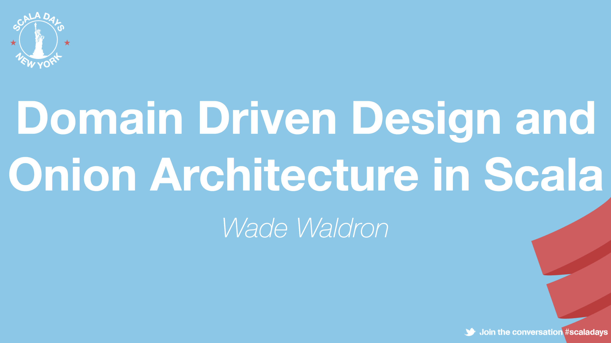
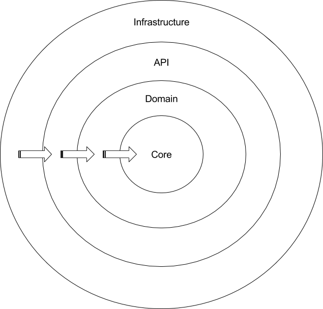
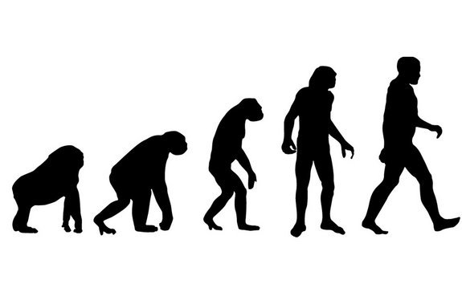
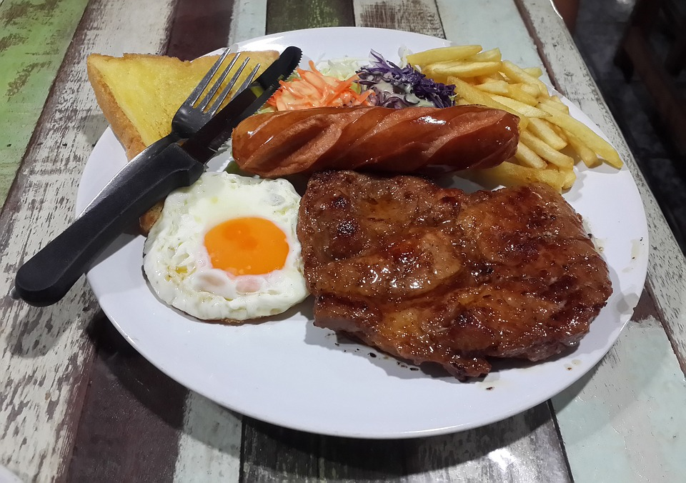
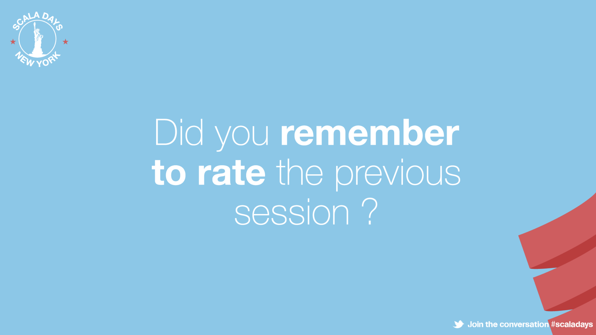
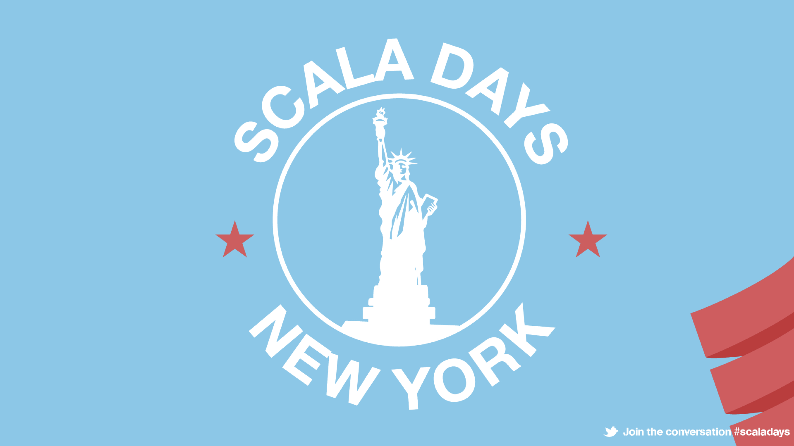

theme: Plain Jane

^ My name is Wade Waldron.  I am a Senior Consultant with Lightbend.

^ Co-Author of Applied Akka Patterns.

^ Today I am going to be talking about Domain Driven Design and Onion Architecture in Scala

^ I wanted to talk about DDD and Onion Architecture because the introduction of these tools brought many improvements to my code.

^ Clarity

^ Portability

^ Accuracy



---

^ Don't forget to rate the presentation.


---

## Introduction

^ DDD is not CQRS or Event Sourcing.

^ Focus on Core DDD but also Onion Architecture

^ Onion Architecture not required.

Domain Driven Design is often combined with:
- CQRS
- Event Sourcing
- Onion Architecture
- It is not required

---

## Case Study

^ Case Study: How to Fry an Egg

^ Specifically, what happens when someone requests that an egg be cooked.  What is the process.

^ Lots of good nuances and edge cases.

^ Relatable

^ Easy to understand

^ Not "over done"


### How to fry an egg with Domain Driven Design and Onion Architecture

---

^ "What is a Domain?"

^ A sphere of knowledge. eg. Selling products, geological process, cooking an egg.
 
^ DDD focuses on the core domain.

^ De-emphasize technologies, user interfaces, etc.

^ Core Domain is often more constant.

^ Capturing truth of the real world in the domain model.

^ Software is not the model.  It is an implementation
  
^ Other implementations include documentation or diagrams.

^ DDD encourages communication between domain and technical experts.

^ Experts communicate using a common language.

## What is Domain Driven Design?

- Domain: A sphere of knowledge
- Domain Driven Design: A technique for developing software that puts the primary focus on the core domain

---

## Ubiquitous Language

^ Common language is the Ubiquitous Language.

^ Set of concepts in the domain understood by experts.

^ Code should reflect the domain model.

^ We want to be able to talk to Domain experts about the model.

^ Avoid vague terms like "entity" or "process" or "action".

- A common language that can be used by domain experts and technical experts
- Reflected in the software model

---

## Case Study: Language

^ Here are terms from the domain.

^ A domain expert (chef, cook) can understand

^ Some terms may not end up in our code.


- Nouns
  - Cook
  - Egg, Sunny Side Up, Scrambled
  - Stove, Frying Pan
- Verbs
  - Fry, Prepare
  - Crack

---

## Bounded Contexts

^ Capturing a complex domain requires too much logic, results in spaghetti.

^ Bounded Contexts to solve.

^ Subset of the domain.

^ Outside the Bounded Context words/rules may have different meanings.

^ Bounded Contexts + Microservices

- The setting or context where ideas from the ubiquitous language apply
- Outside of the bounded context, the words meaning may change, or it may not apply
- Bounded Contexts fit well with Microservice Architectures

---

## Case Study: Bounded Contexts

^ What are the bounded contexts in our case study?

^ Food Prep

^ Grocery Shopping

^ Washing Dishes

^ Frying pan has no meaning while grocery shopping.

^ Egg has different meaning in washing dishes.

^ Trying to create one domain for all of this would be too big.


- **Food Preparation**
- Grocery Shopping
- Washing Dishes

---

## Domain Building Blocks
 
^ Building Blocks for DDD
 
^ Find more info on Wikipedia or the DDD book by Eric Evans
 
- Value Objects: A domain object defined by it's attributes
- Entity: A domain object defined by an identity
- Aggregate: A collection of objects bound by a root entity
- Service: Contains operations that don't fit other domain objects
- Repository: Abstraction for retrieving instances of domain objects
- Factory: Abstraction for creating instances of domain objects

---

## Case Study: Domain Objects

^ Examples of domain objects, pulled from ubiquitous language.


- Cook, CookFactory, CookRepository
- Egg, EggStyle
- FryingPan

---

## Traditional Layered Architecture


---

## Onion Architecture

^ We know what DDD is, what is Onion Architecture?

^ Applications separated into layers, like an onion.

^ Domain near the center of the onion

^ Other layers build around Domain

^ Outer layers depend on/coupled to inner layers

^ Inner layers have no knowledge of outer layers

^ Inner layers define interfaces

^ Outer layers implement interfaces

^ Core: Basic Building Blocks

^ Domain: Key business logic

^ API/Services: Public Interface to the Domain

^ Infrastructure: External dependencies, User Interfaces, Databases



- Application is built around the domain
- Outer layers depend on and are coupled to the inner layers
- Inner layers are decoupled from the outer layers
- Inner layers define interfaces that may be implemented in the outer layers

---

# API

^ Lets look at the API

^ Good starting point

^ Defines what kind of questions we want to ask the domain

^ Inputs/Outputs

---

## Decoupling the Domain

^ API Insulates Domain from Infrastructure.  Keeps it from bleeding, keeps it consistent.

^ Restructure domain as it evolves without affecting infrastructure.  API stays the same.

^ Good place for high level tests.


- API Insulates the Domain from the Infrastructure
- Provides a single consistent code interface
- Domain can be restructured/rewritten without affecting the Infrastructure
- API is a good place for high level functional tests

---

## Case Study: The First Crack

^ First crack at some code.

^ Look at the code

^ Issues

^ Scrambled? Sunny Side Up? Poached?

^ Would you ever hand an egg and say cook this?

^ Time?  Doesn't capture the time to cook the egg.

```scala
class FoodPrepApi {
  def fry(egg: Egg): FriedEgg = ???
}
```
---

## Case Study: Second Crack

^ Address our previous issues.

^ Egg Style

^ No longer handing the Egg

^ Returning a Future, encapsulates time and failure

^ What types of failures?

^ Recoverable: Egg was dropped (should be fixed without returning a failure)

^ Unrecoverable: Out of eggs (have to return a failure.  Can not complete.)

```scala
class FoodPrepApi {
  def prepareEgg(style: EggStyle): Future[CookedEgg] = ???
}
```

---

## Case Study: Functional Testing

^ Functional Tests around API

^ Simple test.  Nothing mocked or stubbed.  

^ Real Repos, real Domain Classes.

^ Verifies that everything works when wired together.

```scala
class FoodPrepApiTest extends FreeSpec with ScalaFutures {
  "prepareEgg" - {
    "should return a CookedEgg with the specified style" in new TestModule {
      val style = EggStyle.SunnySideUp
      val expectedEgg = CookedEgg(style)

      whenReady(foodPrepApi.prepareEgg(style)) { egg =>
        assert(egg === expectedEgg)
      }
    }
  }
}
```

---

# Domain

^ API required a minimal amount of Domain to be created.

^ Use High Level test to drive out domain.

^ API or test may evolve as we further explore domain.

---

## Case Study: How would you like your eggs?

^ Created Egg Style.  See Slide.

^ Created Egg.  See Slide.

^ Both implemented as Algebraic Data Types

```scala
sealed trait EggStyle

object EggStyle {
  case object Scrambled extends EggStyle
  case object SunnySideUp extends EggStyle  
  case object Poached extends EggStyle
}

sealed trait Egg

object Egg {
  case object RawEgg extends Egg
  case class CookedEgg(style: EggStyle) extends Egg
}
```
---

## Algebraic Data Types

^ Algebraic Data Types good for building domains.

^ Capture domain logic in the Type system.

^ Compiler can test domain rules, rather than writing tests.

- Useful for building rich domains
- Provide added type safety
- Capture truth of the domain at compile time

---

## Tiny Types

^ Related to ADTs is Tiny Types or Wrapper Types

^ Lightweight wrapper classes around primitive data types.

^ Compile time checking of the model.

^ No bare strings or integers.

^ Ensures we don't accidentally pass the wrong string or integer to a function.

^ Provides a location to hang validation logic (eg. Email Address)

^ Enriches Domain

- Compile time checking of primitives
- Encapsulates data validation
- Use "AnyVal" to avoid memory cost of wrapper classes

---

## Case Study: Identifying our Cook

^ Example of a Tiny Type.

^ Accidentally mix up Ids or mix other types where we wanted Ids.

^ Prevents mistakes

^ Enables us to later enrich the class and our domain.

```scala
  case class CookId(value: String) extends AnyVal
```
---

## Case Study: Aggregate Root

^ We can identify our cook.  This means Cook is an Entity.

^ Cook Aggregates other parts of the domain (eg. Frying Pan or Spatula)

^ Cook is our Aggregate Root

^ Bulk of operations will interact with the cook.

^ How do we know it's an aggregate root?


---

## Aggregate Roots

^ Qualities of Aggregate Root

^ Aggregates other entities

^ Controls access to entities

^ Other entities forbidden from accessing without going through the aggregate first.

^ Not always obvious.  Cooks seems straight forward.

^ If entity is focus of domain operations, may be aggregate root.

^ If deleted or destroyed, deletes other entities, may be aggregate root.

^ Cook example.  Delete Frying Pan?  Is it relevant without a cook?

^ Cook aggregates frying pan.

- Aggregates other entities.  The top most entity that aggregates other entities is the Aggregate Root.
- Controls access to those entities.
- Other entities are forbidden from accessing the child entities without first going through the Aggregate Root.

---

## Case Study: Broken Frying Pan

^ Domain Class Frying Pan

^ Flawed.

^ Takes an option.  Constant checking if Egg is present.

^ Returning Try.  Wrap exceptions

^ Cooks don't ever add eggs to full frying pans

^ Cooks don't ever remove eggs from empty frying pans.

^ Awkward to use, awkward to test, and wrong.

```scala
case class FryingPan(cookingEgg: Option[PartiallyCookedEgg] = None) {
  import FryingPan._

  def add(egg: RawEgg, style: EggStyle): Try[FryingPan] = {
    cookingEgg match {
      case Some(_) => Failure(FryingPanFullException)
      case None => Success(this.copy(Some(egg.startCooking(style))))
    }
  }

  def remove(): Try[(FryingPan, CookedEgg)] = {
    cookingEgg match {
      case Some(egg) => egg.finishCooking().map(cookedEgg => (this.copy(None),cookedEgg))
      case None => Failure(FryingPanEmptyException)
    }
  }
}
```

---

## Case Study: Fixed Frying Pan

^ Alternative implementation.  Better.  Uses ADT.

^ Compiler won't let us add an egg to a full frying pan or remove from an empty frying pan.

^ Compile time checking of our domain model.  YAY.

^ Encoded rules of the domain inside methods that are part of the domain class, but also types.

^ No more options, tries, or exceptions.

^ Simpler to test.

```scala
sealed trait FryingPan

case class EmptyFryingPan() extends FryingPan {
  def add(egg: RawEgg, style: EggStyle): FullFryingPan = FullFryingPan(egg.startCooking(style))
}

case class FullFryingPan(egg: PartiallyCookedEgg) extends FryingPan {  
  def remove(): (EmptyFryingPan, CookedEgg) = (EmptyFryingPan(), egg.finishCooking())
}
```
---

## Evolving Truth

^ DDD is about evolving understanding of the domain.

^ Reflecting evolution in the code.

^ Rough edges signal the model might be wrong.

^ Find the rough edges and fix the model and the code.

^ Domain may change.  New laws, new technologies.  Model must change with it.

^ Domain models aren't fixed.  Need to be prepared to evolve the model.



- We never know the truth of the domain until we have spent time with it.

---

# Infrastructure

^ DDD and Onion Architecture help evolve model by separating concerns.

^ Domain is separate from infrastructure.  They can evolve independently.

^ API layer ensures Infrastructure and Domain remain separate and distinct.

^ Repositories and Factories insulate us from concerns like data storage.

---

## Repositories and Factories

^ Repositories and Factories.  Part of the Domain.

^ Implementations are usually in Infrastructure.

^ Usually an element of infrastructure (file system, database etc) involved with creating or retrieving objects.

^ Don't leak these concerns into the domain.  Wrapped in Repo or Factory to keep domain pure.

^ Often abstract over a database, but could be a file, or REST API or even in memory.

- Abstract over data storage/creation concerns
- Keeps the infrastructure from leaking into the domain
- Not limited to databases
  - Database
  - File
  - REST Api
  - In Memory
  
---

## Case Study: A Carton of Eggs

^ Simple example of a trait for Egg Repository.

^ Nothing to indicate the nature of the repo (Carton, Fridge, other).

^ Defines operations to perform, but not how they will be performed.

^ I provide In Memory implementations, but could be replaced with DB access.

^ Repository is not tied to implementation, so we can change as necessary.

```scala
trait EggRepository {
  def findAndRemove(): Future[Option[RawEgg.type]]
  def add(egg: RawEgg.type): Future[Unit]
}
```


---

## Dependency Inversion Principle

^ Onion Architecture relies on the Dependency Inversion Principle.

^ High level modules don't depend on low level modules.

^ Depend on abstractions.

^ Dependency Inversion Principle is often implemented with Dependency Injection

^ Injector supplies necessary dependencies where needed.

> High-level modules should not depend on low-level modules. 
> Both should depend on abstractions.

- Onion Architecture relies on the Dependency Inversion Principle
  - High Level Modules = Inner Layers
  - Low Level Modules = Outer Layers
- Domain often defines traits that are implemented in Infrastructure
- Often implemented with Dependency Injection

---

## Case Study: Cake and Eggs

^ Sample code uses "thin cake pattern" (Adam Warski).  I developed this technique independently, inspired by Cake pattern, and later discovered his blog about it.

^ Further adapted here for Onion Architecture.

^ Series of traits, defined and organized according to Onion Architecture.

^ Traits define pieces of the application that are part of that layer of the onion.  These are "modules".

^ Models provide concrete implementations where possible, or left abstract to be defined later in another layer.

^ Various layers organized into packages.  Modules exist in corresponding package.

^ Modules follow same rules as Onion Architecture.  Inner modules not allowed to depend on outer modules.

```scala
trait DomainModule {
  def cookRepository: CookRepository
  def eggRepository: EggRepository
}

trait ApiModule { this: DomainModule =>
  implicit def executionContext: ExecutionContext
  val foodPrepApi: FoodPrepApi = new FoodPrepApi(cookRepository)
}

trait InfrastructureModule { this: DomainModule with ApiModule =>
  override val eggRepository: EggRepository = new InMemoryEggRepository()
  override val cookRepository: CookRepository = new InMemoryCookRepository(eggRepository)
  override implicit def executionContext: ExecutionContext = scala.concurrent.ExecutionContext.global
}

class Injector extends InfrastructureModule with ApiModule with DomainModule

```

---

## Closing Remarks



^ DDD is evolutionary.  Don't build it once and call it done.

^ Learn as we go.  Update our understanding.

^ Done well code can be readable, maintainable, portable.

^ Past projects, common to invisibly change database implementations.

^ Sometimes swapped entire domain logic without clients noticing because API didn't change.

^ Adding new ways to access Domain (REST vs Event Driven vs GUI) trivial due to re-use of API call.

^ End goal to move us away from worrying about specific implementation details

^ Focus instead on how software will be used.  Not the user interface, that's just presentation.

^ What is the real problem we are trying to solve?  How is it solved when software isn't there?

^ DDD is about finding the people who can answer these questions, and talking to them in language they understand.

^ Taking understanding gained through this conversation and reflecting it in code.

---

GitHub Repo: https://github.com/WadeWaldron/scaladays2016

Twitter: @wdwaldron
LinkedIn: https://www.linkedin.com/in/wadewaldron

---



---


