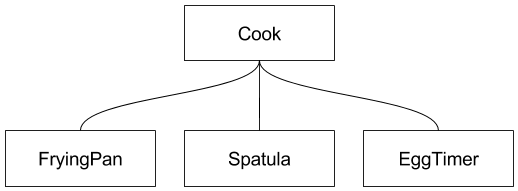

# Domain Driven Design and Onion Architecture in Scala
^ Hello, welcome to my presentation on Domain Driven Design and Onion Architecture in Scala.

^ My name is Wade Waldron.  I am a Senior Software Developer with BoldRadius

^ I started using Domain Driven Design and Onion Architecture a few years back while working on real estate software. It was a long journey to get where I am today, and it's far from over.  I am still learning about DDD.
 
^ One thing I found was that there is a lot of concepts that get rolled in with Domain Driven Design that are actually unrelated.  If you research you will find it tied up with Event Sourcing and CQRS, but in fact Domain Driven Design can be accomplished without those things.  

^ Today we will be focusing on the core of Domain Driven Design, and we will be adding Onion Architecture as a 
complement to that.

^ Onion Architecture is not a requirement for doing DDD, but I have found it complements it very well.

### - Wade Waldron (@wdwaldron) -
### - Senior Software Developer with BoldRadius -

---

## Case Study

^ Throughout this presentation we will be referring to a specific case study.  We will use the example of "how to fry an egg".

^ More specifically, the domain we are exploring will start from the point of requesting an egg, cooked to a specific style, and it will end when that egg is completed and received by the requester.

^ I like this example because it seems simple on the surface, but when you delve deeper you find there are nuances and edge cases that provide a fair amount of depth. It's also a concept that everyone can relate to. I can start talking about this domain without having to spend a lot of time trying to explain the rules.

^ Another thing I like about this domain is that it is a very non-traditional software domain. Everyone uses the "customer" domain. But the problem with more traditional domains is that they have been done so many times, it can be difficult to separate out what is the actual domain, and what is simply the way it's always been done.


### How to fry an egg with Domain Driven Design and Onion Architecture

---

^ Okay, we have been throwing around a lot of words, but if you are like me, then you may actually be asking "but what is a domain?"

^ A domain represents a sphere of knowledge.  That knowledge could be anything.  It could be the business rules around selling products online.  It could be the physical laws that govern geological processes. It could be the actions and events that occur while trying to cook an egg.
 
^ Domain Driven Design is a technique for developing software that puts the primary focus on the core domain.  When building software using Domain Driven Design, we don't want to focus on things like the database, or the REST api, or even the user interface.  These things are important, and we do need to worry about them, but they also change.  User interfaces evolve over time.  REST Api's go through different versions.  Databases can come and go.

^ Domain Driven Design is about capturing the truth of the world in the Domain Model. While many aspects of our  infrastructure may change, our business rules, our domain rules, often remain fairly constant. We start by designing a Domain Model that captures as many of those rules as we can as accurately as we can.  Then we write our software to reflect that domain model. Let's be clear here.  The software is not the model. It is an implementation of the model. We could create other implementations of the model using diagrams or documentation.  Each of these is just another implementation of that domain model. The model is simply our understanding of the real world.

^ In order to achieve this, Domain Driven Design encourages frequent communication between Domain Experts, and Technical experts. Domain experts are people involved in the process who know a lot about the rules of the domain, but are not necessarily technical. They could be end users, marketing, lawyers, upper management, janitors, or anyone else who can provide insight into how the domain works.

^ In order for domain experts to communicate effectively with the technical experts, they need to be able to speak a common language.

## What is Domain Driven Design?

- Domain: A sphere of knowledge
- Domain Driven Design: A technique for developing software that puts the primary focus on the core domain

---

## Ubiquitous Language

^ DDD introduces the concept of the Ubiquitous Language.  Ubiquitous Language is a set of terms and concepts that are central to the domain being modelled. These are concepts that are well understood by the domain experts.

^ When building software using DDD, our code should reflect the ubiquitous language. We should try to use the same names in our code that are being used by the domain experts.

^ A key goal in DDD is creating a model that we can talk about with our Domain Experts. We want those experts to be able to understand us when we talk about the model because if they understand the model then they can potentially point out places where the model doesn't correctly reflect the domain.

^ This means that when we build software using Domain Driven Design we want to avoid vague terms like "entity", or "process", or "action", unless they are part of the domain. Sometimes it is necessary to create higher level abstractions and this may necessitate introducing words or concepts that are not part of the standard domain, but there needs to be an agreement between the domain experts and the technical experts about what those abstractions represent. These can then become part of the ubiquitous language that is used by both groups.

- A common language that can be used by domain experts and technical experts
- Reflected in the software model

---

## Case Study: Language

^ Going back to our case study.  Here are a few pieces of the domain language that will be easily recognizable by our domain experts.  If you sat down with someone to talk about how to cook eggs, you could safely use any of these words without worrying about losing them in the language.

^ Some or all of these terms will in turn be reflected in our software model.


- Cook
- Egg, Sunny Side Up, Scrambled
- Stove, Frying Pan

---

## Bounded Contexts

^ One problem that often arises when we are building software is that the domain model is excessively complex. Trying to capture that model becomes because your domain objects need to encapsulate so much logic, and so many rules, that they start to look like spaghetti.  And as much as I love to eat spaghetti, I don't want it in my code.

^ DDD solves this by using Bounded Contexts. A bounded context is a specific subset of the domain.  Within that subset of the domain, certain ideas from the model may be present while other ideas may not.  In fact, the meaning of words in the ubiquitous language can change from one bounded context to the next.

^ Bounded Contexts fit very well with Microservice Architectures.  Understanding how a Domain breaks up into multiple contexts can be a critical part of building effective microservice architectures.

- The setting or context where ideas from the ubiquitous language apply
- Outside of the bounded context, the words meaning may change, or it may not apply
- Bounded Contexts fit well with Microservice Architectures

---

## Case Study: Bounded Contexts

^ So let's look at bounded contexts in our case study. We have isolated our case study to just one single bounded context, specifically, food preparation.  But there are other bounded contexts that are part of the larger domain

^ If we are going to cook eggs, then we need to first get those eggs.  That means that there might be a separate context related to grocery shopping.  When we run out of eggs we need to add eggs to a grocery list so that we can get more next time we are shopping.

^ Once we have cooked our eggs, we need to clean up after ourselves.  We need to wash the frying pan so that it is ready for the next time we want to cook. So we may have a "washing dishes" context as well.

^ You will note, that in the grocery shopping context, a frying pan has little meaning. You don't use or need a frying pan in order to buy eggs. A cook also has no meaning in this context.

^ In the dishwashing context an egg does not mean the same thing as in the food preparation context. Eggs are still present in this context, but now they are the disgusting thing you are trying to scrape off the pan, rather than the tasty delight that will be served with your toast.

^ If we were to try to marry all of these concepts into a single model, we would end up with a disgusting thing we want to scrape out of our code.  This is what makes bounded contexts so critical. They allow us to encapsulate pieces of our domain into specific contexts where they have meaning.


- **Food Preparation**
- Grocery Shopping
- Washing Dishes

---

## Domain Building Blocks

^ There are various pieces we use when building domains using domain driven design. We won't go into a lot of detail on these.  You can find more detail about them on wikipedia or other places. 

- Value Objects: A domain object that is defined by it's attributes
- Entity: A domain object that is defined by an identity
- Aggregate: A collection of objects bound by a root entity
- Service: A container for operations that don't conceptually fit other domain objects
- Repository: An abstraction layer for retrieving existing instances of domain objects
- Factory: An abstraction layer for creating new instances of domain objects

---

## Case Study: Domain Objects

^ Here are some examples of domain objects in our case study.  You will note that these names are pulled right from the ubiquitous language we talked about earlier.


- Cook, CookFactory, CookRepository
- Egg, EggStyle
- FryingPan

---

## What is Onion Architecture

^ So, hopefully we now have a decent idea of what domain driven design is.  Don't worry, we will explore it in more detail.

^ But what about Onion Architecture?  What is that?

^ Onion Architecture separates your application into multiple layers that are built around the domain.  The domain is central to the software.

^ Outer layers of the onion depend on, and are coupled to the inner layers.

^ Inner layers on the other hand are decoupled from the outer layers

^ Inner layers defined interfaces that may be implemented in the outer layers.

^ Core: Basic building blocks. Collections, Akka, Scalaz etc.

^ Domain: Key domain/business logic. Entities, Aggregates, Repositories, Services etc.

^ API: Defines the "public" interface to the Domain. I was originally told this was the "services" layer.  However, I don't like the term services, because it's overloaded, especially when it comes to domain driven design.  I prefer the term API because I think it better reflects what this layer is trying to achieve.

^ Infrastructure: External Dependencies, User Interfaces, Database etc.


- Application is built around the domain
- Outer layers depend on and are coupled to the inner layers
- Inner layers are decoupled from the outer layers
- Inner layers define interfaces that may be implemented in the outer layers

---

# API

^ Let's focus in more detail on the individual layers of the Onion.  I am going to start with the API.  This might seem a little backwards, since we are focusing so heavily on the domain we might expect to start there.  I like to start with the API though because it helps me to define what kinds of questions I will need to ask my domain.  This is where I am defining the inputs and outputs to the domain.  I am defining the operations that we will perform.

---

## Decoupling the Domain

^ The API acts as a layer of insulation between the Domain and the Infrastructure.  This is important because it helps us to keep them from bleeding into each other.  It's also important because it provides a single consistent interface to the domain.  How we interact with that interface will be determined in the infrastructure, but what the operations are will be determined by the API.

^ This insulation layer means that we can restructure or rewrite the domain as our understanding of it evolves.  As long as we keep the API layer the same, the infrastructure doesn't necessarily need to change.  We just need to adapt the API to the new reality of the domain.

^ This is also a fantastic place to start testing. When I am writing code using Domain Driven Design, my first step is usually to define that API interface.  My second step is then to write a high level functional test around that API. This high level test is basically just a simple end to end happy path test.  I don't go into details around all the edge cases.  I will leave that for the unit tests.


- API Insulates the Domain from the Infrastructure
- Provides a single consistent code interface
- Domain can be restructured/rewritten without affecting the Infrastructure
- API is a good place for high level functional tests

---

## Case Study: The First Crack

^ Okay, let's take a crack at some code.  What might an API for our case study look like?

^ Here we have a very simple API.  You can see a single method "fry" which takes an egg and returns a fried egg. That's pretty simple.  But is it correct?

^ I can see some issues right out of the gate with this api. 
 
^ How is this egg going to be cooked?  Will it be scrambled? Will it be sunny side up?

^ Also we are requesting that someone cook an egg for us, presumably a cook. In the real world, when do you ever hand someone an egg and ask them to cook it? Generally, you ask them for an egg, cooked a certain way, and you leave it up to them to go get the egg.
  
^ Another issue is time.  This model doesn't capture time.  When we ask for an egg it is going to take time to be cooked. We don't want to stand around waiting for that egg to be cooked. We want to be able to read the news, or check facebook or whatever the kids are doing these days.  So we need an API that reflects the time that will be taken and allows us to continue with our business.

```scala
trait FoodPrepApi {
  def fry(egg: Egg): FriedEgg
}
```
---

## Case Study: Second Crack

^ Here is a new version of the API.

^ This version addresses our previous issues.  We provide an EggStyle to the API.  This means we can now specify how we want our eggs done.

^ We are no longer handing an egg to the API.  Instead we are just requesting the style and relying on the API to take care of getting the Egg.  This better reflects what happens in the real world.

^ We are returning a future. This captures the element of time in the API. It also captures the possibility of failure which is another interesting aspect of the domain. What kind of failures might we encounter?

^ There are recoverable failures, like what if the egg was dropped.  In that case though, I would hope that the cook would simply fix the problem and my egg would be delayed rather than abandoned entirely.

^ But there are also unrecoverable failures. If the cook goes to cook the egg and discovers someone forgot to do the grocery shopping, then they might have to fail the operation entirely.

```scala
trait FoodPrepApi {
  def prepareEgg(style: EggStyle): Future[CookedEgg]
}
```

---

## Consistent Api

^ By creating a consistent Api that hides our domain we create a preferred way to interact with that domain.

^ Initially we may build our application as a GUI that talks directly to the code.  In this case our GUI will communicate with the domain through the API

^ Later, when we decide we want to introduce a REST Api for our application, we can do so simply by having it talk to the same API.

^ If we decide we want an event driven architecture backed by a message bus it's the same thing.  All of these interfaces simply talk to the same API and make the same calls.  This makes it trivial to add new types of interfaces on top of the existing functionality.


---

## Case Study: Functional Testing

^ Now that we have an Api that we are happy with, the next step that I usually take is to write a functional test around that Api.  Here is what such a test might look like:

^ It's a relatively simple test.  It's just verifying that the Egg we get back from the Api is the egg that we expect. The key here though is that nothing in this test is mocked or stubbed. The repositories are real, the domain classes are real. This verifies that when we wire all the pieces together, or application works as expected.

```scala
class FoodPrepApiTest extends FreeSpec with ScalaFutures {
  "prepareEgg" - {
    "should return a CookedEgg with the specified style" in new TestModule {
      val style = EggStyle.SunnySideUp
      val expectedEgg = CookedEgg(style))

      whenReady(foodPrepApi.prepareEgg(style)) { egg =>
        assert(egg == expectedEgg)
      }
    }
  }
}
```

---

# Domain

^ We have built our API.  Doing this required that we flesh out a very minimal amount of our domain. Now that we have this high level test, we can use it to drive out the implementation of our domain.  As we explore the domain, we may find that our Api evolves slightly, or that our test does, but that's okay.  Domain Driven Design isn't about getting everything right the first time.

^ Let's start by exploring an aspect of our Domain that we have already defined for this test.

---

## Case Study: How would you like your eggs?

^ For our Domain we created a trait called EggStyle.  EggStyle has a number of implementations.  You can see a few of them in the slide.

^ We also created another trait called Egg as well as a couple of implementations of that trait.

^ These are implemented as Algebraic Data Types.

```scala
sealed trait EggStyle

object EggStyle {
  case object Scrambled extends EggStyle
  case object SunnySideUp extends EggStyle  
  case object Poached extends EggStyle
}

sealed trait Egg

case object RawEgg extends Egg
case class CookedEgg(style: EggStyle) extends Egg
```
---

## Algebraic Data Types

^ Algebraic Data Types are great for building domains. They allow us to capture a lot of information about the nature of the domain, just in the types. If we can capture domain rules in this way it has huge benefits because it means we can leverage the compiler to test our domain rules, rather than having to write our own tests.

- Useful for building rich domains
- Provide added type safety
- Capture truth of the domain at compile time

---

## Tiny Types

^ A concept related to Algebraic Data Types is the concept of Tiny Types or Wrapper Types. These are very small, lightweight wrapper classes that we create around primitive data types. Like with Algebraic Data Types, a tiny type allows us to create compile time checking of our model.

^ Rather than using a bare string or integer we create a wrapper around it. By doing this, we can ensure that we don't accidentally pass the wrong integer in as a parameter to a function. We have type checking that ensures that our types are correct.

^ Tiny Types also provide us a location to hang any validation logic. We could for example validate that a string follows a particular pattern (like an email address).

- Compile time checking of primitives
- Encapsulates data validation
- Use "AnyVal" to avoid memory cost of wrapper classes

---

## Case Study: Identifying our Cook

^ Here we see an example of a Tiny Type.  The CookId could simply be passed around as an Integer, but this can be dangerous.  Using bare integers for Ids leads us to potential problems.  We could accidentally write code that puts the wrong integer in the wrong place.  We could for example accidentally pass an Egg Id if we had such a thing, or even something silly like a quantity where we wanted an Id.

^ The wrapper type prevents us from making those mistakes.  It also enriches our domain and provides us with a location to attach any domain rules about those types.

```scala
  case class CookId(value: Integer) extends AnyVal
```
---

## Case Study: Aggregate Root

^ Now we have a way to identify a Cook.  Because they are uniquely identifiable using an Id, this makes the Cook an entity. More than that though, our Cook actually aggregates other parts of the domain, like frying pan or spatula. This makes the Cook an Aggregate Root.

^ In the Food Preparation domain, the bulk of our domain operations will interact with the Cook Aggregate Root.

^ So how do you know which entities are going to be your Aggregate Roots?



---

## Aggregate Roots

^ It's not always obvious which entities in our domain will be the Aggregate Roots.  In our Food Preparation Domain, the choice of Cook seems relatively straight forward, but it isn't always that easy.

^ So how do we know which entities should be our aggregate roots?

^ If an entity is going to be the focus of many of our domain operations, then that is a clue that it might be an aggregate root.

^ If you delete/destroy the entity and removing it results in the removal of other entities, then that is a clue that it might be an aggregate root.

^ Take our Cook example.  If you remove the cook, does the frying pan get removed with them? You might argue that it doesn't.  The frying pan is not part of the cook, therefore it sticks around. That would seem to suggest that the Cook does not in fact aggregate the frying pan.  But let's look a bit deeper.  If you eliminate the Cook, then does the frying pan have meaning in the domain?  In the absence of a Cook, is the frying pan useful in any way?  Without a Cook, the frying pan is a useless hunk of metal.  So in that respect you can say that the frying pan is intrinsically tied to the presence of a Cook.  This means the Cook aggregates the frying pan.

- Aggregates other entities.  The top most entity that aggregates other entities is the Aggregate Root.
- Controls access to those entities.
- Other entities are forbidden from accessing the child entities without first going through the Aggregate Root.

---

## Case Study: Broken Frying Pan

^ Here we have another domain class.  This is a FryingPan. This implementation has problems though.

^ Frying pan takes an option.  This means checking all the time if the egg is present.

^ We are returning Try which means wrapping exceptions.

^ What cook tries to add another egg to an already full frying pan?

^ What cook tries to remove an egg from an empty frying pan?

^ This model is awkward to use, awkward to test, and basically wrong.

```scala
case class FryingPan(cookingEgg: Option[PartiallyCookedEgg] = None) {
  import FryingPan._

  def add(egg: RawEgg, desiredStyle: EggStyle): Try[FryingPan] = {
    cookingEgg match {
      case Some(_) => Failure(FryingPanFullException)
      case None => Success(this.copy(Some(egg.startCooking(desiredStyle))))
    }
  }

  def remove(): Try[(FryingPan, CookedEgg)] = {
    cookingEgg match {
      case Some(egg) => egg.finishCooking().map(cookedEgg => (this.copy(None),cookedEgg))
      case None => Failure(FryingPanEmptyException)
    }
  }
}
```

---

## Case Study: Fixed Frying Pan

^ Here we have an alternative implemenation of the Frying Pan.  This version is better. You can see it uses an algebraic data type.

^ The cook won't try to remove an egg from an empty frying pan or add one to a full frying pan. They literally can't. The compiler won't allow it. We have compile time checking of our domain model which is fantastic.

^ We have encoded the rules about the domain inside methods that are part of the domain classes and also in the types themselves.

^ We have eliminated options, trys, and exceptions.  And in doing so we have dramatically simplified the tests that we need to write.

```scala
sealed trait FryingPan

case class EmptyFryingPan() extends FryingPan {
  def add(egg: RawEgg, style: EggStyle): FullFryingPan = FullFryingPan(egg.startCooking(style))
}

case class FullFryingPan(egg: PartiallyCookedEgg) extends FryingPan {  
  def remove(): (EmptyFryingPan, CookedEgg) = (EmptyFryingPan(), egg.finishCooking())
}
```
---

## Evolving Truth

^ Domain Driven Design is about evolving our understanding of the domain, and reflecting that evolution in the code.

^ Often when building the domain model we find rough edges. We find areas where the code feels awkward.  This is usually a sign that we have the model wrong.  We need to look for these rough edges and try to draw out what is really happening.  We then evolve the model appropriately.

^ Sometimes the domain itself changes.  A new law may cause us to have to do our work differently.  A new technology may change the way people work in the business.  When the domain changes the model needs to change with it.

^ Domain models aren't fixed. You don't create the domain model once and then forevermore use the same model. You need to be prepared to evolve the model.


- We never know the truth of the domain until we have spent time with it.

---

# Infrastructure

^ One way that Domain Driven Design and Onion Architecture help us evolve our model is by keeping the domain separate from the infrastructure.  By decoupling these things we can evolve the domain independently of the Infrastructure.

^ The Api layer ensures that the Domain and Infrastructure remain separate and distinct instead of bleeding into each other.

^ Repositories and Factories act as insulators, keeping concerns about data storage from leaking into the domain.  We know we need to store data, but how and where we store it is an infrastructure concern, not part of the domain.

---

## Dependency Inversion Principle

^ The Dependency Inversion Principle is a big part of Onion Architecture.  This is the idea that high level modules should not depend on low-level modules, instead they should depend on abstractions.  In this case when we talk about high level modules we are talking about the inner layers of the onion like the domain.  Low level modules are your outer layers, your infrastructure.

^ In order to implement the Dependency Inversion Principle we can use Dependency Injection.  Dependency Injection uses an "Injector" to supply the necessary dependencies to the code where they are needed.  The clients of the Injector are not allowed to reference the Injector.

> High-level modules should not depend on low-level modules. Both should depend on abstractions.

- Onion Architecture relies on the Dependency Inversion Principle
- Domain often defines traits that are then implemented in Infrastructure
- Dependency Injection can be used to implement inversion of control

---

## Case Study: Cake and Eggs

^ In the sample code I use a dependency injection pattern that was inspired by the Cake pattern, but is not what I would call vanilla cake.

^ The basic idea is to take a series of traits that can be defined and organized to follow Onion Architecture.  These traits define the pieces of the application that will be part of that layer in the Onion.

^ Where possible, the Module traits will provide concrete implementations of the various pieces.  If a concrete implementation is not available in the current layer, then it will be left abstract and will be defined in another layer of the Onion

^ In the sample code, the various layers are organized into packages.  The modules then exist inside the appropriate package.  They also follow the same Onion Architecture rules as the rest of the code.  Inner Modules are not allowed to depend on outer modules.

```scala
trait DomainModule {
  def cookRepository: CookRepository
  def eggRepository: EggRepository
}

trait ApiModule { this: DomainModule =>
  implicit def executionContext: ExecutionContext
  val foodPrepApi: FoodPrepApi = new FoodPrepApi(cookRepository)
}

trait InfrastructureModule { this: DomainModule with ApiModule =>
  override val eggRepository: EggRepository = new InMemoryEggRepository()
  override val cookRepository: CookRepository = new InMemoryCookRepository(eggRepository)
  override implicit def executionContext: ExecutionContext = scala.concurrent.ExecutionContext.global
}

trait TestModule extends InfrastructureModule with ApiModule with DomainModule

```

---

## Repositories and Factories

^ Repositories and factories, while technically part of the domain, really are much more of an infrastructure element.
  
^ The idea behind them is that there is usually an element of infrastructure involved with creating or retrieving domain objects.  Usually we have to access a database or perform similar operations.  Rather than leaking these concerns into the domain, we wrap them in a repository or factory.  This keeps our domain pure.

^ While they often abstract over top of a database, they don't have to.  Implementations could be talking to a database, or a file, or a REST Api, or even just in memory.

- Abstract over data storage/creation concerns
- Keeps the infrastructure from leaking into the domain
- Not limited to databases
  - Database
  - File
  - REST Api
  - In Memory
  
---

## Case Study: A Carton of Eggs

^ Here we can see a very simple trait for the Egg Repository.  Note that nothing about this indicates the nature of the repository.  The repository could be a carton of eggs, it could be a basket, or a fridge.

^ The repository defines the operations that will be performed, but the implementation details about how it will be performed are part of the infrastructure.  In the sample code I have provided an In Memory implementation, but it could just as easily be accessing a database.

^ Because the Repository, and therefore the domain, are not tied to the specific implementation, we are free to change the implementation as necessary.  This could mean swapping to use a different database, or perhaps moving our database access behind a REST Api.  Or it could be as simple as changing the data layout in the database.

```scala
trait EggRepository {
  def findAndRemove(): Future[Option[RawEgg.type]]
  def add(egg: RawEgg.type): Future[Unit]
}
```

---

## Closing Remarks


^ Domain Driven Design is an evolutionary process. We don't build a domain one and then call it done. We learn about the domain as we go and we have to continually update our understanding and our code to keep it from stagnating.

^ When done well, Domain Driven Design can help make your code more readable, maintainable, and portable.

^ In past projects, when working with DDD and Onion Architecture., it was common for my team to invisibly change database implementations, simply by swapping in a new repository. We would sometimes realize that our domain was flawed, and rewrite the entire thing, again without clients noticing, because the clients only ever spoke to the API.  Where we originally designed an application to be Event Driven, we might later decide we want a REST Api as well.  Adding that on was trivial because we were simply re-using an existing Api call.

^ The end goal of these techniques is to move us away from worrying about the specific details of the implementation, and to focus instead of how the software will be used.  And when we talk about how the software will be used, we don't mean the user interface. That is certainly important, but the user interface is just a presentation layer for the software.  We really want to focus on what is the real world problem that we are trying to solve. How is that real world problem actually dealt with in the absence of the software?

^ Domain Driven Design is about finding the people who can answer these types of questions, and then speaking to them in a language that they can understand.  It's about taking the understanding gained through this interaction and reflecting it in our code.

---

# Questions

GitHub Repo: https://github.com/WadeWaldron/scaladays2016
